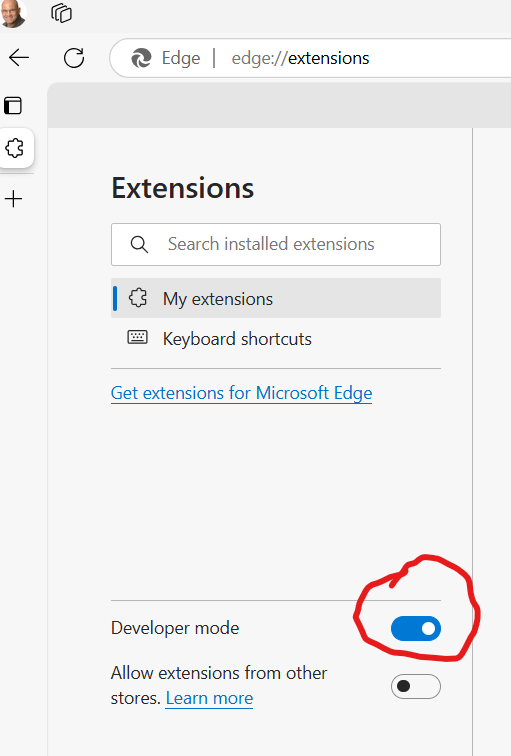
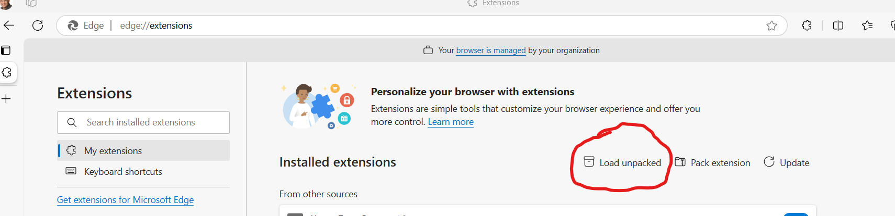
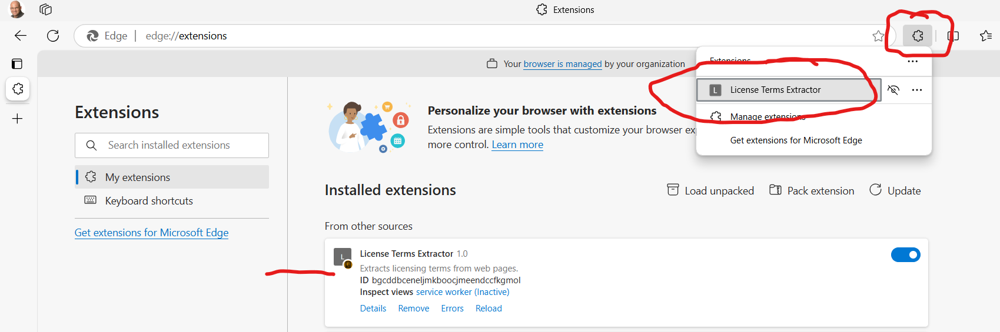

# Licence Terms Privacy checker extension
Experiment to create an extension that gathers the licencing terms from a site, summarises and attempts to extract if there is any explicit mention of selling your private data in any form.

An edge extension (only tested in edge thus far).

# How to use
* Clone this repo to a directory
* In a new tab window in edge, navigate to `edge://extensions/`
* Enable developer mode

* Select 'Load unpacked'

* Navigate to the cloned directory, and select the 'src' directory.
* You should now be able to invoke the extension on any web page you navigate to.

